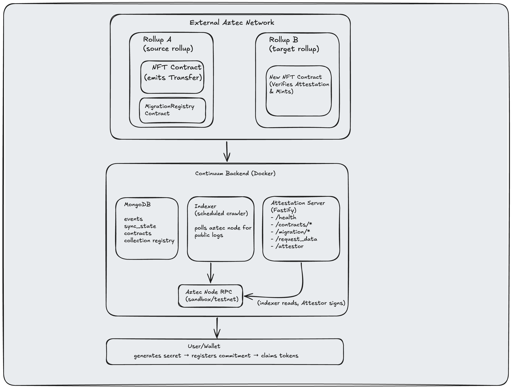

# Continuum

Continuum solves one of the hardest problems in rollup development: **how do users carry their state forward when aztec rollup upgrades**

# What Problem Continuum Solves

When an Aztec L2 rollup migrates to a new version, all on-chain state is reset. Users who held NFTs, tokens, or other assets on the old rollup need a way to prove those holdings and recreate them on the new rollup — without trusting any single party and without requiring access to the old rollup's private data.

Continuum provides a cryptographic bridge between old and new rollup state using:

- An event indexer that reads public events from the old rollup
- An attester service that signs user state claims with a Schnorr key
- A Noir smart contract on the new rollup that verifies those signatures and records the migration

## Architecture



Continuum is made of three off-chain services and a set of Noir contracts:

- **MongoDB** stores indexed events, sync cursors, contract ABIs, and old→new collection mappings.
- **Indexer** polls the old rollup’s Aztec node for public events and writes them to MongoDB.
- **Fastify API** exposes admin and public endpoints; it signs migration claims with a Schnorr attester key.
- **Noir contracts** live on both rollups. The old collection emits ownership and registration events; the new collection verifies Continuum’s attestation and mints the migrated asset.

## Migration Flow

1. **Register contracts**: upload the old collection ABI to the API and register the old→new collection address mapping.
2. **Create a migration secret**: the user calls `/migration/new-secret` and saves the secret.
3. **Register the commitment on the old rollup**: the user calls `MigrationRegistry.register_migration(collection, commitment)` (or the NFT contract’s own registration function), where `commitment = Poseidon2("NFTMR" ‖ secret)`.
4. **Index events**:the indexer crawls the old rollup and stores `Transfer` and `MigrationRegistered` events.
5. **Request signed claim data**: the user reveals the secret to `/request_data`; the API recomputes the commitment, resolves the verified owner, and returns Schnorr-signed attestations for each owned token.
6. **Claim on the new rollup**: the user calls `newNFT.migrate_and_claim(token_id, commitment, signature)`, which verifies the signature and mints the token.

For a complete step-by-step example, see [`e2e-tests/src/sandbox/index.ts`](e2e-tests/src/sandbox/index.ts). For a recent testnet run, see [`e2e-tests/src/testnet/run_logs_july_1.txt`](e2e-tests/src/testnet/run_logs_july_1.txt).

## Quick Start

### Prerequisites

- Docker and Docker Compose
- Bun or Node.js for local development

### Running with Docker Compose

1. **Clone the repository**

   ```bash
   git clone git@github.com:raven-house/continuum.git
   cd continuum
   ```

2. **Configure environment**

   ```bash
   cp .env.example .env
   ```

   If trying on Aztec Sandbox, download Aztec CLI from https://docs.aztec.network/developers/getting_started_on_local_network and start sandbox using `aztec start --local-network`

   Set `AZTEC_NETWORK=sandbox` in `.env` file

3. **Start all services**

   ```bash
   docker compose up -d
   ```

   This starts:
   - MongoDB on port 27017
   - Event Indexer (background service)
   - REST API on port 3004

4. **Register contracts for indexing**

   Upload each Aztec contract ABI through the API. The API extracts event
   selectors and stores the indexing configuration in MongoDB for the indexer.

   ```bash
   curl -X POST http://localhost:3004/contracts/upload \
     -H "Content-Type: application/json" \
     -d '{
       "artifact_id": "my-contract",
       "name": "My Contract",
       "abi": { /* Noir ABI JSON */ },
       "enabled": true,
       "event_types": ["Transfer", "Mint"],
       "start_block": {
         "testnet": 5000,
         "sandbox": 0
       }
     }'
   ```

   Omit `event_types` or pass an empty array to index all events in the ABI.

5. **Check service status**

   ```bash
   docker compose ps
   ```

6. **View logs**

   ```bash
   # All services
   docker compose logs -f

   # Specific service
   docker compose logs -f indexer
   docker compose logs -f api
   docker compose logs -f mongodb
   ```

7. **Stop services**

```bash
docker compose down
```

To also remove the MongoDB volume (WARNING: deletes all data):

```bash
docker compose down -v
```

List all docker volumes

```bash
docker volume ls
```

## Development

### Live Reload (no rebuild on code changes)

`docker-compose.yml` is the default local development stack. It mounts the source files as volumes so changes are reflected without rebuilding.

```bash
# First time — build images to bake in dependencies
docker compose up -d --build

# After any code change — just restart, no rebuild
docker compose up -d

# Only rebuild when adding/removing npm packages
docker compose up -d --build
```

```bash
# Run contract test cases
aztec test
```

### Production deploy

In production, explicitly use the production compose file so self-contained built images are used and source code is not mounted from the host:

```bash
docker compose -f docker-compose.prod.yml up -d
```

## API Endpoints

All endpoints are on port **3004**.

### Available Endpoints

| Method | Path                                                           | Purpose                                |
| ------ | -------------------------------------------------------------- | -------------------------------------- |
| GET    | `/health`                                                      | API liveness                           |
| POST   | `/contracts/upload`                                            | Upload ABI and indexing config (admin) |
| GET    | `/contracts` / `/contracts/:id` / `/contracts/event/:selector` | Query uploaded contracts               |
| POST   | `/collections/register`                                        | Map old→new collection address (admin) |
| GET    | `/collections` / `/collections/:newAddress`                    | List / lookup mappings                 |
| GET    | `/migration/new-secret`                                        | Generate migration secret + commitment |
| POST   | `/migration/commitment`                                        | Recompute commitment from secret       |
| POST   | `/request_data`                                                | Request signed token attestations      |
| GET    | `/attester`                                                    | Get the attester public key            |

### Contract ABI Upload

```bash
# Upload contract ABI and extract events with selectors
curl -X POST http://localhost:3004/contracts/upload \
  -H "Content-Type: application/json" \
  -d '{
    "artifact_id": "my-contract",
    "name": "MyContract",
    "abi": { /* Noir ABI JSON */ },
    "enabled": true,
    "event_types": ["Transfer"],
    "start_block": {
      "testnet": 5000,
      "sandbox": 0
    }
  }'

# List all uploaded contracts
curl "http://localhost:3004/contracts?page=1&limit=10"

# Get specific contract by ID
curl http://localhost:3004/contracts/<contract-id>

# Find event by selector
curl http://localhost:3004/contracts/event/0x12345678
```

## Troubleshooting

### Indexer Not Processing Events

```bash
# Check indexer logs
docker compose logs -f indexer

# Verify registered contracts
curl "http://localhost:3004/contracts?page=1&limit=10"

# Check indexer health (inside the indexer container)
curl http://localhost:8080/health
```

### API Not Responding

```bash
# Check API logs
docker compose logs -f api

# Verify API is running
curl http://localhost:3004/health
```

### Run NFT Contract Tests

`nft_contract` tests need the compiled `generic_proxy` artifact in their target folder:

```bash
cd contracts/generic_proxy
aztec-nargo compile
cp target/generic_proxy-GenericProxy.json ../nft_contract/target/
cd ../nft_contract
aztec test
```

Address of Migration registry contract on testnet version 5.0.0-rc2 is :- `0x0f10ac27189276a91039bd47317783b1f76ce2fa1f26b89be1df464c08a5b3b3`

## License

MIT

## Contributing

Contributions are welcome! Please open an issue or pull request.
